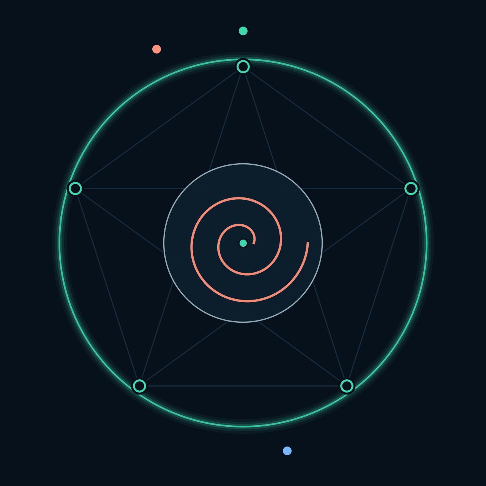
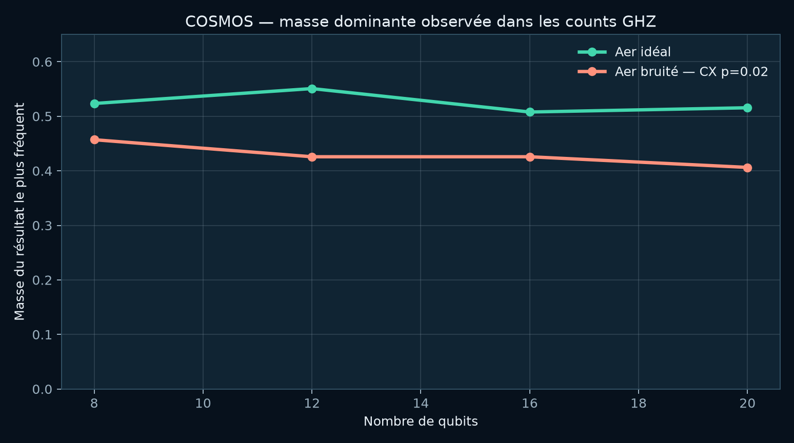
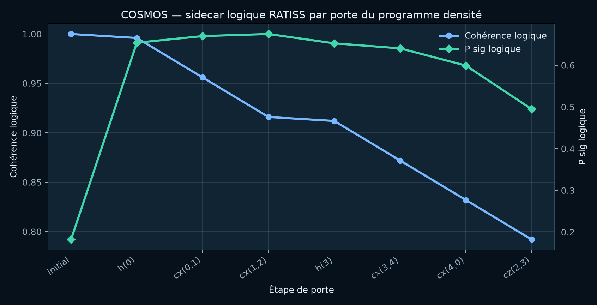
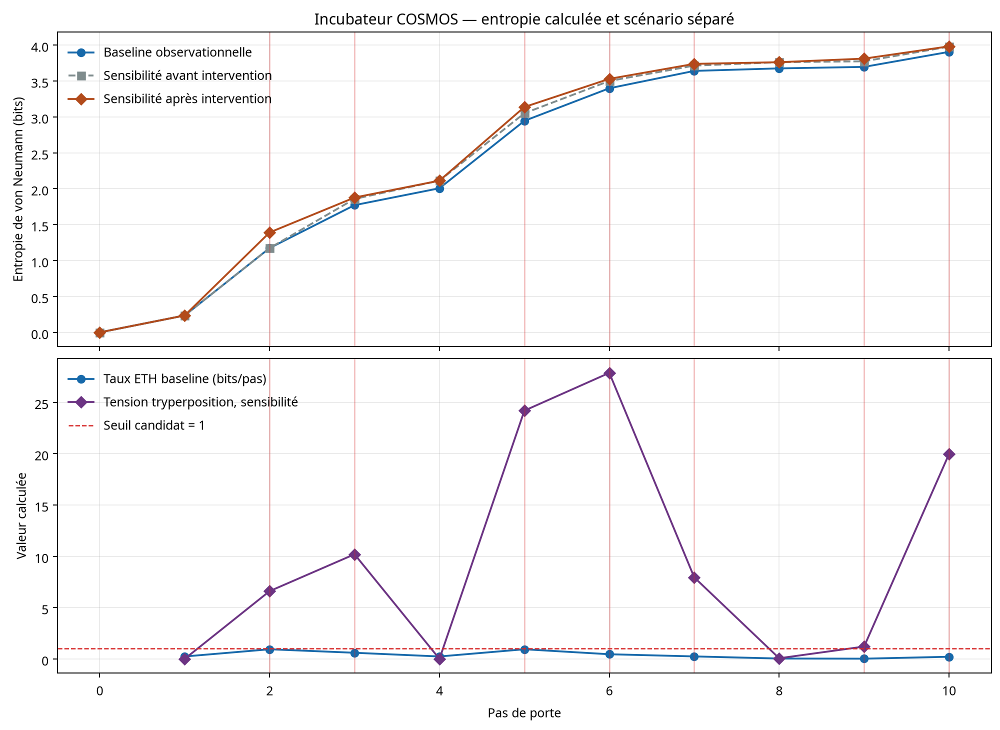
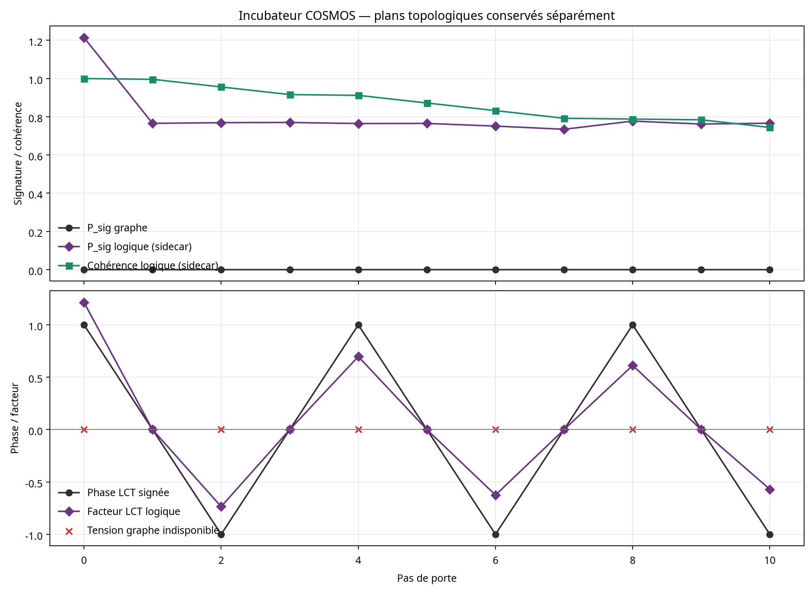

<p align="center">
  
</p>

<h1 align="center">QPU-Ratiss-COSMOS</h1>

<p align="center">
  <strong>Laboratoire de simulation QPU locale</strong><br/>
  Circuits bruités · trajectoires de matrices densité · topologie algorithmique RATISS —<br/>
  artefacts reproductibles et vérifiables sur CPU.
</p>

<p align="center">
  <a href="LICENSE"></a>
  
  
  
  
  
</p>

<p align="center">
  <em>Architecte & investigateur principal : <strong>Jonathan Evina</strong> ·
  <a href="https://orcid.org/0009-0000-4092-5313">ORCID 0009-0000-4092-5313</a></em>
</p>

---

## Sommaire

1. [Nature de l'instrument](#1-nature-de-linstrument)
2. [Frontière de revendication](#2-frontière-de-revendication)
3. [Trois régimes expérimentaux](#3-trois-régimes-expérimentaux)
4. [Résultats calculés et reproduits](#4-résultats-calculés-et-reproduits)
5. [L'incubateur LCT-ETH](#5-lincubateur-lct-eth)
6. [Pile technologique](#6-pile-technologique)
7. [Démarrage et reproduction](#7-démarrage-et-reproduction)
8. [Tests et vérifications](#8-tests-et-vérifications)
9. [Couplage LCT-ETH et validation QPU réel](#9-couplage-lct-eth-et-validation-qpu-réel)
10. [Documents du laboratoire](#10-documents-du-laboratoire)
11. [Citation et licence](#11-citation-et-licence)

---

## 1. Nature de l'instrument

COSMOS est un **instrument de mesure logiciel**, pas un simulateur de matériel. Il examine une question unique :

> **Comment rendre visible une trajectoire de circuit bruitée, ses associations et les états topologiques logiciels RATISS, sans jamais confondre ces objets avec un QPU physique ?**

Il conserve chaque grandeur réellement calculée par le simulateur — y compris quand un signal topologique vaut zéro, quand une tension est indéterminée, ou quand un sidecar n'est pas applicable. Un champ non calculable dans le contrat reste `null`, avec une raison explicite, plutôt qu'une valeur de convenance.

| Type de projet | Exécution | Entrées principales | Sortie principale |
|---|---|---|---|
| Simulation quantique reproductible | Qiskit Aer local (`density_matrix`, `stabilizer`) | Circuit GHZ, programme à cinq qubits, profils LCT-ETH déclarés | Counts bruts, corrélations, topologie, sidecar logique, trajectoires thermodynamiques instrumentées |

## 2. Frontière de revendication

> **Ce dépôt est une simulation QPU virtuelle.** Il n'exécute aucun job sur matériel, ne reproduit aucune calibration matérielle, ne revendique ni la fabrication d'un qubit topologique ni une correction d'erreur, et ne démontre aucune suprématie sur une instance TSP.

La provenance de chaque artefact porte `validated_on_hardware = false`. Cette frontière est une exigence méthodologique du laboratoire, pas une réserve rhétorique.

## 3. Trois régimes expérimentaux

Trois contrats de données distincts, volontairement non fusionnés :

| Régime | Entrées | Grandeurs calculées | Volontairement absent |
|---|---|---|---|
| `counts_scaling` | Counts GHZ Aer, 8 → 20 qubits | Masse dominante, association RATISS, topologie de graphe | Matrice densité, `P_sig` logique |
| `density_topology` | Programme à cinq qubits sous bruit déclaré | Densité, corrélations, topologie de graphe, sidecar `TopologicalQubit` | Preuve QPU, correction d'erreur, modèle de dispositif |
| `incubator_lct_eth` | Même programme densité, deux profils | Entropie, taux ETH, facteurs LCT, impacts, route TSP, scénarios séparés | Calibration cryogénique réelle, ETH statistique, contrôle matériel |

Un vecteur de counts est une observation échantillonnée : il n'autorise pas à reconstruire implicitement une matrice densité complète. L'incubateur conserve `P_sig` de graphe et `P_sig` logique dans deux champs distincts et ne substitue jamais l'un à l'autre.

## 4. Résultats calculés et reproduits

### 4.1 Mise à l'échelle des counts GHZ



La masse du résultat le plus fréquent est calculée à partir des counts Aer bruts (seed `42`, canal CX dépolarisant `p=0.02`, 256 tirs). Aux quatre tailles testées, la courbe bruitée reste sous la courbe idéale. Données : [`artifacts/cosmos_run.json`](artifacts/cosmos_run.json).

| Qubits | Profondeur CX | Masse idéale | Masse bruitée | `P_sig` graphe (counts) |
|---:|---:|---:|---:|---:|
| 8 | 7 | 0.523438 | 0.457031 | 0.0 |
| 12 | 11 | 0.550781 | 0.425781 | 0.0 |
| 16 | 15 | 0.507812 | 0.425781 | 0.0 |
| 20 | 19 | 0.515625 | 0.406250 | 0.0 |

### 4.2 Sidecar logique de la trajectoire densité



Régime densité à cinq qubits (ne pas lire comme une métrique des counts GHZ) : cohérence logicielle et `P_sig` algorithmique du sidecar au fil des portes réellement exécutées.

### 4.3 Tableau des observations enregistrées

| Observation | Valeur | Lecture autorisée |
|---|---:|---|
| Counts 20 qubits, masse idéale | 0.515625 | Échantillonnage pour ce seed et ce nombre de tirs |
| Counts 20 qubits, masse bruitée | 0.406250 | Effet du canal déclaré, pas sur appareil réel |
| Topologie de graphe dans les counts | `P_sig = 0.0` | Conservée, non corrigée ni remplacée |
| Dernière étape densité, `P_sig` logique | `0.4948611575` | Sortie du sidecar, séparée du graphe |
| Incubateur baseline, entropie finale | `3.9055306800` bits | Simulation sous le profil de bruit déclaré |
| Incubateur tryperposition, tension max (baseline) | `17.3833666846` | Canal Q×I×M, pendant l'oscillation déterministe |
| Incubateur tryperposition, tension max (sensibilité) | `356.9757698741` | Scénario `alpha_0=0.05`, pas une tension matérielle |
| Incubateur, `P_sig` graphe | Oscillation déterministe `0 → 0.133231 → 0` | Tryperposition non contrôlée, équivalent LCT |

## 5. L'incubateur LCT-ETH



L'incubateur relie une trajectoire Aer cinq qubits à l'entropie de von Neumann calculée, à la variation entropique par pas, aux facteurs LCT et au sidecar logique RATISS. Son canal actif est la **tryperposition** `Psi = Q x I x M` : une amplitude issue de la densité simulée (Q), les deux signaux topologiques déjà calculés (I) et un témoin d'intégrité de trace (M). Il n'écrase ni le `P_sig` de graphe ni le `P_sig` logique. Il fournit deux scénarios versionnés — une **baseline strictement observationnelle** et une **sensibilité avec déphasage local explicite** — la seconde n'écrasant jamais la première.



**L'oscillation de `P_sig` est le phénomène étudié, pas un artefact.** Aux onze frontières de porte, la persistance du graphe suit `0 → 0.033454 → 0.133231 → 0.025041 → 0.065933 → 0.111181 → 0.041562 → 0 → 0.015558 → 0.0048 → 0`. C'est le régime de **tryperposition non contrôlée** — l'équivalent, pour un système d'information universel, de ce que la LCT décrit pour les systèmes intriqués : la persistance naît, croît et meurt sous la trajectoire sans être pilotée. Elle est produite par un bruit de décohérence **déterministe** (graine figée par pas) : la même exécution donne toujours la même oscillation, la rendant rejouable et auditable. Sa tension propre reste `null` (référence initiale nulle) — cette absence est conservée honnêtement, sans division par epsilon. En baseline, le canal tryperposition passe de `0.1879842865` à `0.1299670353` (tension max `17.3833666846`) ; le sidecar logique, séparément, de `0.1821619076` à `0.5893783934`.

**ETH est l'environnement virtuel de cryogénie de l'instrument.** Le terme désigne la métrique interne de variation entropique (« effondrement thermodynamique »), non l'*Eigenstate Thermalization Hypothesis*. À chaque frontière de porte, ETH mesure combien d'entropie le « bain » environnant échange avec le qubit logique simulé — comme un cryostat enferme un dispositif réel. La température de `15 mK` est la métadonnée de cette enveloppe ; les paramètres Aer réellement utilisés sont `T1`, `T2`, les durées de porte et les probabilités dépolarisantes. C'est une **équivalence logicielle instrumentée**, pas une calibration cryogénique matérielle. [1]

## 6. Pile technologique

| Couche | Technologie | Rôle |
|---|---|---|
| Langage | Python ≥ 3.11 | Instrument complet |
| Simulation quantique | Qiskit 2.5.2 · Qiskit Aer 0.17.2 | Matrices densité (`density_matrix`), counts (`stabilizer`), canaux de bruit |
| Calcul numérique | NumPy ≥ 1.26 | Algèbre linéaire dense, décomposition spectrale |
| Topologie | Vietoris-Rips (GF(2), maison) | Persistance H0/H1, `P_sig` |
| Routage d'inspection | Held-Karp exact ≤ 10 nœuds, 2-opt au-delà | Routes TSP d'inspection, jamais un avantage TSP |
| Visualisation | Matplotlib | Figures dérivées exclusivement des artefacts JSON |
| Tests | pytest | Contrats de données et reproductibilité |
| Artefacts | JSON versionné | `ratiss.cosmos.run.v1`, `ratiss.cosmos.incubator.v1` |

Le moteur topologique source ([`ratiss-topological-decoherence-engine`](https://github.com/evinajonathan13-max/ratiss-topological-decoherence-engine)) est une dépendance **explicite par chemin local** — la provenance reste visible, aucune implémentation divergente n'est cachée dans COSMOS.

## 7. Démarrage et reproduction

```bash
git clone https://github.com/evinajonathan13-max/QPU-Ratiss-COSMOS.git
git clone https://github.com/evinajonathan13-max/ratiss-topological-decoherence-engine.git
cd QPU-Ratiss-COSMOS
python3 -m pip install -e .

# Régimes counts + densité
PYTHONPATH=../ratiss-topological-decoherence-engine/src \
python3 scripts/run_cosmos.py \
  --engine-src ../ratiss-topological-decoherence-engine/src \
  --output artifacts/cosmos_run.json --shots 256

# Incubateur LCT-ETH (baseline + sensibilité)
PYTHONPATH=../ratiss-topological-decoherence-engine/src \
python3 scripts/run_incubator.py \
  --engine-src ../ratiss-topological-decoherence-engine/src \
  --output artifacts/incubator_lct_eth_run.json

# Figures dérivées des seuls artefacts
python3 scripts/generate_docs_figures.py
python3 scripts/generate_incubator_figures.py
```

Deux exécutions successives du même artefact produisent un contenu **bit-pour-bit identique** : la reproductibilité est une propriété vérifiable de l'instrument, pas une promesse.

## 8. Tests et vérifications

```bash
PYTHONPATH=../ratiss-topological-decoherence-engine/src python3 -m pytest -q
```

Les tests contrôlent la chaîne GHZ demandée, la lecture des counts bruts, la séparation des contrats counts/densité, la préservation d'un `P_sig` de graphe nul, l'indisponibilité honnête d'une tension à référence nulle, la séparation baseline/sensibilité, le couplage LCT-ETH stabilisé et l'existence des figures documentaires.

## 9. Couplage LCT-ETH et validation QPU réel

### 9.1 Couplage LCT-ETH stabilisé

L'incubateur couple désormais les deux piliers — superposition (LCT) et effondrement thermodynamique (ETH, la cryogénie virtuelle) — via une modulation **stabilisée** de l'amplitude d'apprentissage :

```text
eth_modulation = exp(-|eth_rate|)          # strictement positif, borné dans (0, 1]
delta_w_coupled = η · φ · P_sig · C · eth_modulation
```

Quand le bain cryogénique virtuel est calme (`|ΔS/Δt| ≈ 0`), la modulation vaut `1` (apprentissage complet autorisé). Quand il est agité (grand `|ΔS/Δt|`), elle tend vers `0` (l'apprentissage est suspendu). Ce facteur ne peut **ni inverser le signe du gradient ni l'amplifier** : il amortit seulement, ce qui garantit la stabilité du facteur d'apprentissage — là où le couplage naïf `ΔW · ETH(t)` divergerait quand `ETH(t) < 0`. Mesuré en baseline : à l'étape 2, `eth_rate = 0.94` → modulation `0.39` → delta amorti de `-0.041` à `-0.016`.

### 9.2 Validation contre un QPU IBM réel

Un circuit de Bell à deux qubits (`h(0) ; cx(0,1) ; measure`) a été soumis **une fois** au backend réel `ibm_marrakesh` (156 qubits, IBM Quantum Platform). L'artéfact [`artifacts/qpu_validation.json`](artifacts/qpu_validation.json) conserve le **Job ID traçable** `da5u376vhnc73fmhnug`, les counts matériels, et compare la divergence LCT entre la simulation Aer locale et le résultat QPU réel.

| Source | Counts | Masse marquée `|11⟩` | Divergence LCT |
|---|---|---:|---:|
| Idéal (Bell pur) | `{00:256, 11:256}` | 0.500 | — |
| Aer bruité (CX p=0.02) | `{00:265, 11:243, 01:2, 10:2}` | 0.4746 | 0.000309 |
| **QPU réel ibm_marrakesh** | `{00:255, 11:243, 01:9, 10:5}` | 0.4746 | 0.000309 |

> **Lecture honnête.** Les masses marquées coïncident (`0.4746`), donc la divergence LCT calculée est identique (ratio 1.0). Le sidecar ne capte pas la différence entre les erreurs `01`/`10` d'Aer (2/2) et du QPU réel (9/5) : il réagit à la masse globale, pas à la structure des erreurs. C'est une **limite documentée** du couplage actuel, pas une revendication de correspondance parfaite. Le QPU valide que le matériel réel reste dans la bande prévue par la simulation pour un état de Bell ; il ne certifie pas que le sidecar prédit le bruit matériel détaillé.

Le token IBM est lu **uniquement** depuis la variable d'environnement `IBM_QUANTUM_TOKEN` ; il n'est jamais écrit dans l'artéfact, le dépôt ni aucun log.

## 10. Documents du laboratoire

| Document | Rôle |
|---|---|
| [`PROTOCOL.md`](docs/PROTOCOL.md) | Hypothèses, trois régimes, frontières de revendication |
| [`ARCHITECTURE.md`](docs/ARCHITECTURE.md) | Flux de données et séparation des objets analysés |
| [`RESULTS.md`](docs/RESULTS.md) | Valeurs réellement observées et recette de reproduction |
| [`INCUBATOR_CONTRACT.md`](docs/INCUBATOR_CONTRACT.md) | Variables, conventions de temps, règles de non-substitution |
| [`INCUBATOR_SOURCE_MAP.md`](docs/INCUBATOR_SOURCE_MAP.md) | Réemploi RATISS-Net / ODV-AEON et éléments exclus |
| [`JOINT_TEST_SESSION.md`](docs/JOINT_TEST_SESSION.md) | Rejouer la baseline et préparer une hypothèse |
| [`VISUAL_AUDIT.md`](docs/VISUAL_AUDIT.md) | Vérification des graphiques versionnés |

## 11. Citation et licence

Distribué sous [licence MIT](LICENSE) — © 2026 Jonathan Evina.

```bibtex
@software{evina_cosmos_2026,
  author  = {Evina, Jonathan},
  title   = {QPU-Ratiss-COSMOS: Local QPU Simulation Laboratory
             with RATISS Topological Instrumentation},
  year    = {2026},
  url     = {https://github.com/evinajonathan13-max/QPU-Ratiss-COSMOS},
  note    = {Simulation logicielle reproductible ; aucune exécution sur matériel.}
}
```

## Références

[1] [Qiskit Aer — Building Noise Models](https://qiskit.github.io/qiskit-aer/tutorials/3_building_noise_models.html)
