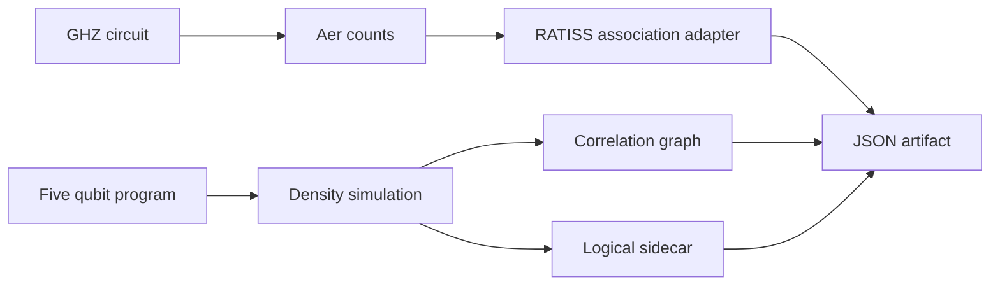

# QPU-Ratiss-COSMOS

# QPU-Ratiss-COSMOS

> **Laboratoire de simulation QPU locale** — circuits bruités, trajectoires de matrices densité et topologie algorithmique RATISS, avec artefacts vérifiables sur CPU.

| Type de projet | Exécution | Entrées principales | Sortie principale |
|---|---|---|---|
| Simulation quantique reproductible | Qiskit Aer local | Circuit GHZ, programme à cinq qubits, bruit CX déclaré | Counts bruts, corrélations, topologie de graphe et sidecar logique |

COSMOS sert à examiner une question précise : **comment rendre visible une trajectoire de circuit bruitée, ses associations et les états topologiques logiciels RATISS sans confondre ces objets avec un QPU physique ?** Il conserve les données mesurées par le simulateur, y compris lorsque le signal topologique de graphe vaut zéro ou qu’un sidecar n’est pas applicable.

> Ce dépôt est une **simulation QPU virtuelle**. Il n’exécute aucun job sur matériel, ne reproduit aucune calibration matérielle et ne revendique pas la fabrication d’un qubit topologique ni une correction d’erreur.

## Résultat visuel calculé


La masse du résultat le plus fréquent a été calculée à partir des counts Aer bruts. Aux quatre tailles testées, la courbe bruitée reste sous la courbe idéale dans cette exécution au canal CX `p=0.02`. Les données et la configuration sont dans [`artifacts/cosmos_run.json`](artifacts/cosmos_run.json).


Cette seconde figure appartient au régime densité à cinq qubits : elle ne doit pas être lue comme une métrique issue des counts GHZ. Elle expose la cohérence et le `P_sig` algorithmique du sidecar au fil des portes réellement exécutées.

## Deux régimes, deux contrats de données

| Régime | Ce qui entre | Ce qui est calculé | Ce qui reste volontairement absent |
|---|---|---|---|
| `counts_scaling` | Counts GHZ Aer, 8 à 20 qubits | Masse dominante, association RATISS, topologie de graphe | Matrice densité et `P_sig` logique |
| `density_topology` | Programme à cinq qubits sous bruit déclaré | Densité, corrélations, topologie de graphe, sidecar `TopologicalQubit` | Preuve sur QPU, correction d’erreur, modèle de dispositif réel |

Cette distinction est un choix de rigueur utile au laboratoire : un vecteur de counts est une observation échantillonnée ; il n’autorise pas à reconstruire implicitement une matrice densité complète. Lorsqu’un champ n’est pas calculable dans le contrat, il reste `null`.

## Architecture



Le diagramme détaillé est dans [`docs/ARCHITECTURE.md`](docs/ARCHITECTURE.md). Les deux chemins convergent vers le même format d’artefact sans être confondus sur le plan scientifique.

## Résultats reproduits dans le dépôt

| Observation | Valeur enregistrée | Lecture autorisée |
|---|---:|---|
| Counts 20 qubits, masse dominante idéale | 0.515625 | Valeur échantillonnée pour ce seed et ce nombre de tirs |
| Counts 20 qubits, masse dominante bruitée | 0.406250 | Effet sous le canal de bruit déclaré, pas sur appareil réel |
| Topologie de graphe dans les counts | `P_sig = 0.0` | Valeur conservée, non corrigée ni remplacée |
| Dernière étape densité | `P_sig logique = 0.7344459623` | Sortie du sidecar algorithmique, séparée du graphe |

Le détail étape par étape, les commandes et les limites sont dans [`docs/RESULTS.md`](docs/RESULTS.md) et [`docs/PROTOCOL.md`](docs/PROTOCOL.md).

## Démarrer localement

Le script utilise le moteur topologique source comme dépendance explicite via un chemin local. Cela rend la provenance visible et évite de cacher une implémentation divergente dans COSMOS.

```bash
git clone https://github.com/evinajonathan13-max/QPU-Ratiss-COSMOS.git
git clone https://github.com/evinajonathan13-max/ratiss-topological-decoherence-engine.git
cd QPU-Ratiss-COSMOS
python3 -m pip install -e .

PYTHONPATH=../ratiss-topological-decoherence-engine/src \
python3 scripts/run_cosmos.py \
  --engine-src ../ratiss-topological-decoherence-engine/src \
  --output artifacts/cosmos_run.json --shots 256
```

## Tests et vérifications

```bash
PYTHONPATH=../ratiss-topological-decoherence-engine/src python3 -m pytest -q
python3 scripts/generate_docs_figures.py
python3 -m json.tool artifacts/cosmos_run.json >/dev/null
```

Les tests contrôlent la chaîne GHZ demandée et la lecture des counts bruts. Les figures sont générées uniquement depuis l’artefact JSON déjà produit ; elles n’ajoutent aucune donnée décorative.

## Documents du laboratoire

| Document | Rôle |
|---|---|
| [`PROTOCOL.md`](docs/PROTOCOL.md) | Hypothèses, deux régimes et frontières de revendication |
| [`ARCHITECTURE.md`](docs/ARCHITECTURE.md) | Flux de données et séparation des objets analysés |
| [`RESULTS.md`](docs/RESULTS.md) | Valeurs réellement observées et recette de reproduction |
| [`VISUAL_AUDIT.md`](docs/VISUAL_AUDIT.md) | Vérification des graphiques versionnés |

Distribué sous [licence MIT](LICENSE).
