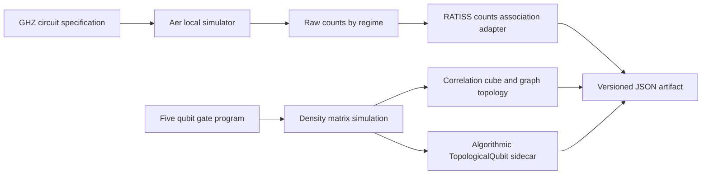

# Architecture COSMOS

COSMOS deliberately preserves two analysis paths. Counts become a declared association structure; they do not silently become a density matrix. The five-qubit trajectory, in contrast, carries density-derived correlations and a separate algorithmic logical sidecar. The JSON keeps both paths rather than forcing them into one metric.
