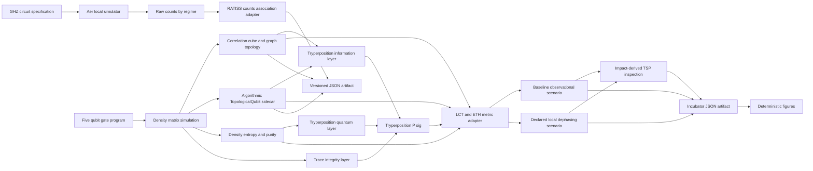

# Architecture COSMOS

COSMOS deliberately preserves three analysis contracts. Counts become a declared association structure; they do not silently become a density matrix. The five-qubit trajectory carries density-derived correlations and a separate algorithmic logical sidecar. The incubator instruments this trajectory with entropy, LCT and ETH candidate metrics while retaining `graph_P_sig`, `logical_P_sig` and `P_sig_tryperposition` independently.

The `P_sig_tryperposition` path composes the density, information and trace-integrity layers and supplies the declared active tension without overwriting the `P_sig` graph value. The baseline scenario only observes the candidate collapse condition. The sensitivity scenario is a separate run: it records the pre-intervention metrics, then applies a declared local dephasing channel only where its own condition is met. The inspection route is derived from impact-selected nodes after measurement and never feeds back as a TSP correction command. The full variable contract is in [`INCUBATOR_CONTRACT.md`](INCUBATOR_CONTRACT.md).
